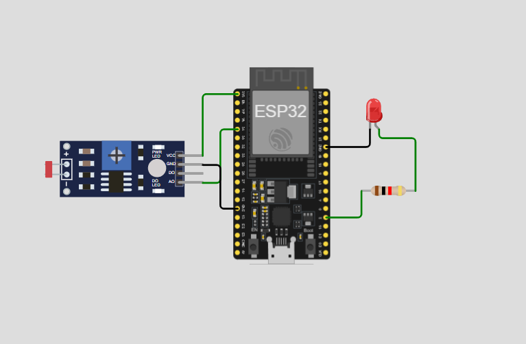
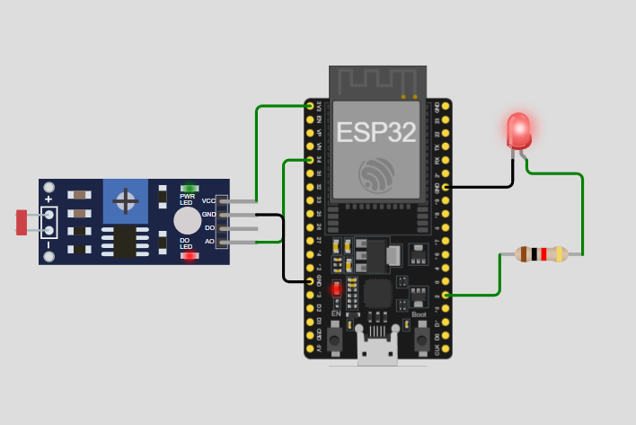
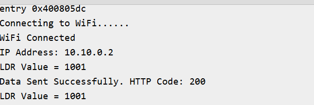
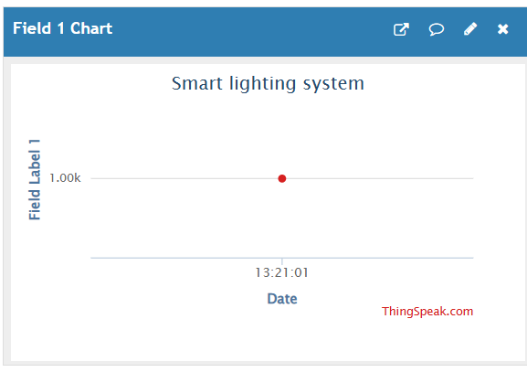

# 🌐 Smart Lighting System using ESP32, LDR Sensor & ThingSpeak

## 📌 Project Overview

The **Smart Lighting System** is an IoT-based project developed using an **ESP32 microcontroller**, an **LDR (Light Dependent Resistor) sensor**, an **LED**, and the **ThingSpeak IoT Cloud Platform**. The ESP32 continuously reads ambient light intensity from the LDR sensor and automatically controls the LED based on the surrounding light conditions. Simultaneously, the sensor readings are uploaded to the ThingSpeak cloud through WiFi, allowing real-time remote monitoring using an online dashboard.

This project demonstrates the practical implementation of cloud-connected IoT systems using the Wokwi simulator.

---

## 🚀 Features

- Real-time ambient light monitoring
- Automatic LED control based on light intensity
- ESP32 built-in WiFi connectivity
- Cloud data logging using ThingSpeak
- Live graphical dashboard for sensor values
- Compatible with Wokwi Simulator
- Easy to understand and implement

---

## 🛠️ Components Used

- ESP32 Development Board
- LDR Sensor Module
- LED
- 220 Ω Resistor
- Wokwi Simulator
- ThingSpeak IoT Cloud Platform

---

## 💻 Software Used

- Wokwi Simulator
- ThingSpeak IoT Cloud
---

## 🔌 Circuit Connections

### LDR Sensor

| LDR Pin | ESP32 Pin |
|---------|-----------|
| VCC | 3.3V |
| GND | GND |
| AO | GPIO34 |

### LED

| LED Pin | ESP32 Pin |
|---------|-----------|
| Anode (+) | GPIO2 (through 220 Ω resistor) |
| Cathode (-) | GND |

---
## Circuit Diagram


## ⚙️ Working Principle

1. The ESP32 connects to the WiFi network.
2. The LDR sensor continuously measures the surrounding light intensity.
3. The analog sensor value is read through GPIO34.
4. The ESP32 compares the sensor value with a predefined threshold.
5. If the light intensity is low, the LED turns ON; otherwise, it remains OFF.
6. The ESP32 uploads the LDR sensor value to the ThingSpeak cloud every 20 seconds.
7. ThingSpeak stores the data and displays it as a live graph for remote monitoring.

---

## 📊 ThingSpeak Setup

1. Create a free account on ThingSpeak.
2. Create a new channel.
3. Enable **Field 1** and rename it as **LDR Value**.
4. Copy the **Write API Key**.
5. Replace the placeholder in the code:

```cpp
String apiKey = "YOUR_WRITE_API_KEY";
```

6. Run the project and monitor the uploaded data on the ThingSpeak dashboard.

---

## ▶️ How to Run

1. Open the project in **Wokwi Simulator** or **Arduino IDE**.
2. Connect the components according to the circuit diagram.
3. Replace the placeholder with your ThingSpeak **Write API Key**.
4. Start the simulation.
5. Open the Serial Monitor to verify WiFi connection and data upload.
6. Open your ThingSpeak channel to view the real-time graph.

---

## 📷 Output
### Circuit Output


### Serial Monitor


### ThingSpeak Output


## 🎯 Applications

- Smart Home Lighting
- Automatic Street Lighting
- Smart Buildings
- Industrial Lighting Control
- Energy Management Systems
- Environmental Monitoring
- IoT Learning Projects

---

## ✅ Advantages

- Real-time cloud monitoring
- Automatic lighting control
- Wireless communication using WiFi
- Low-cost IoT implementation
- Easy to expand with additional sensors
- User-friendly cloud dashboard

## 📄 Project Report

📥 **[Download Project Report](Smart_lighting_System_using_thingspeak.docx)**

## 👨‍💻 Author

**Sushanth Dubagunta**


This project demonstrates how an ESP32 can be integrated with an LDR sensor and the ThingSpeak IoT Cloud Platform to create a smart lighting system capable of automatic light control and real-time remote monitoring. The system continuously measures ambient light intensity, controls an LED accordingly, and uploads sensor data to the cloud for live visualization, making it an effective example of an IoT-based automation application.
